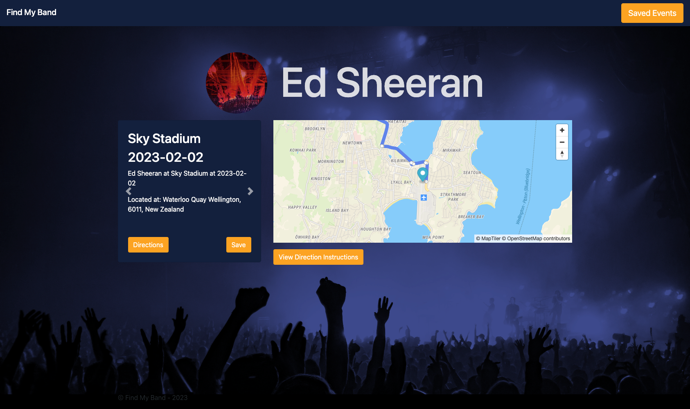
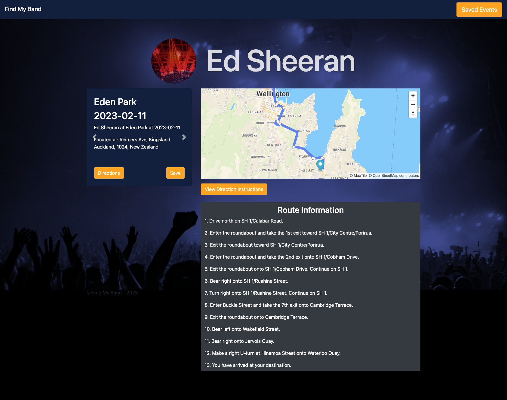

# Find-My-Band
A Web Application which pairs finding out if your favourite musician/artist/band is having a concert near you with how to get there.

## Description
Find My Band is a Web application to search for your favourite musicans, their upcoming event venues, along with map and directions for the users chosen venue.

Using three API's, the web application will return the results from your inputted search, with an events carousel from the chosen artist, map of the chosen venue complete with directions. 

Events can also be saved to access later. 

[Click here](https://jayclay922.github.io/Find-My-Band/index.html) to view the application.

## Built with
* HTML5
* CSS 
* Javascript
* Bootstrap

## Screenshots

## Contributers
* [JayClay922](https://github.com/JayClay922)
* [gthornbuckle](https://github.com/gthornbuckle)
* [Ibrahim-Mohamed45](https://github.com/Ibrahim-Mohamed45)
* [Chriscds](https://github.com/Chriscds)

## Licence
Please refer to the LICENCE in the repository.